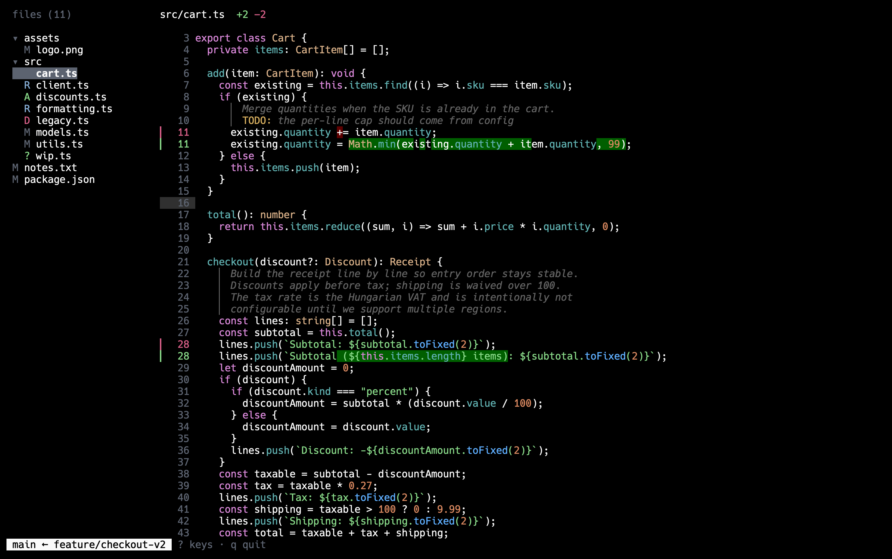

# drift

A terminal UI for reviewing your working changes like a pull request:
everything that differs from the base branch — committed or not — in one
view.



The comparison point is `git merge-base <base> HEAD`, diffed against the
working tree, so committed work, uncommitted edits, and untracked files
all show up together. The base branch is auto-detected (`origin/HEAD`,
then `main`, then `master`), and can be switched from inside the app.

## Install

**macOS / Linux**

```sh
curl -fsSL https://tothalex.github.io/drift/install.sh | sh
```

Prebuilt binaries (x86_64/aarch64) land in `~/.local/bin` (override with
`DRIFT_INSTALL_DIR`).

**Windows (experimental)**

Grab `drift-windows-x86_64.zip` from the
[latest release](https://github.com/tothalex/drift/releases/latest) and
unzip it. Then, from PowerShell in the folder containing `drift.exe`, move
it somewhere permanent and add that folder to your user `PATH`:

```powershell
New-Item -ItemType Directory -Force "$env:LOCALAPPDATA\Programs\drift" | Out-Null
Move-Item drift.exe "$env:LOCALAPPDATA\Programs\drift\"
[Environment]::SetEnvironmentVariable("Path",
  [Environment]::GetEnvironmentVariable("Path", "User") + ";$env:LOCALAPPDATA\Programs\drift", "User")
```

Open a new terminal and `drift` is available. (Alternatively: Start menu →
"Edit environment variables for your account" → edit `Path` → add the
folder there.) Windows Terminal is recommended. Windows support is new —
if something misbehaves, please
[open an issue](https://github.com/tothalex/drift/issues).

Or build from source on any platform: see [Build](#build).

## Usage

```sh
drift              # review the current repo
drift --base dev   # compare against a different base
drift ~/some/repo  # review another repository
drift --pr 123     # open pull request #123 right away
```

## Features

- Changes are shown inside their enclosing code block (function, class,
  if, …) resolved with tree-sitter, not as bare hunks; the scope can be
  widened and narrowed. Rust, Python, JavaScript, TypeScript/TSX, and Go;
  other files fall back to plain hunks.
- Syntax highlighting, with changed lines marked by gutter accents and
  word-level emphasis on the exact edit.
- Comment-only lines render as prose with `TODO`/`FIXME` tags accented;
  unchanged comment blocks can be folded to a one-line summary.
- File tree with review progress: check files off as you go, navigation
  skips what's done. Incremental search with match highlighting.
- Vim-style keys (counts, `g`/`G`, visual mode, yank) and full mouse
  support (wheel per pane, click, drag-to-copy, pane resize).
- Live reload: the working tree is watched, so edits made outside the
  app — your editor, an AI agent, a `git commit` — appear as they land,
  without losing your cursor or scroll position. Gitignored paths
  (build artifacts) never trigger a refresh.
- Press `e` to open the file in your editor at the cursor's line
  (neovim by default, configurable — see below); edits show up in the
  diff the moment you save.
- Review scopes: press `b` (or click the branch name in the status bar)
  to switch the base branch, then narrow the review to one commit or to
  untracked files only — or keep everything at once.
- All views are precomputed on background threads — navigation stays
  instant regardless of changeset size.


Press `?` inside the app for all keybindings.

## Pull requests

Press `p` to list the repository's open pull requests (GitHub) or merge
requests (GitLab), and open one to review it in the same UI: the file
tree, block-scoped diffs, review progress, search — everything works the
same. On top of that:

- Inline review threads appear under the exact diff lines they were
  written on; `t` folds a thread down to its head line. Threads that no
  longer match the current diff stay reachable instead of disappearing.
- A virtual `# conversation` entry at the top of the tree holds the PR
  description, the PR-level discussion, and those outdated threads.
- `a` comments on whatever is under the cursor: a diff line starts a new
  inline thread, and each thread ends in an `[a] reply` row that answers
  it from right there. `A` writes a
  PR-level comment from anywhere. Comments are written in a small
  in-app box — `enter` posts, `shift+enter` (or `alt+enter` in
  terminals without the kitty keyboard protocol) adds a line, `esc`
  cancels. The box's footer shows the keys that work in your terminal.
- On comment rows, `d` (pressed twice) deletes your comment and `r`
  toggles the thread resolved/unresolved — there they shadow their
  global meanings (jump / refresh), as the `[d]`/`[r]` hints under each
  thread indicate. GitHub resolution goes through one `gh api graphql`
  call, which also lets drift show each thread's resolved state.
- `r` refetches the open pull request; `p` (or clicking the `#N` status
  segment) returns to the list, where the first row leads back to your
  local changes.
- When the PR's commits exist locally (after any `git fetch`), diffs get
  full syntax highlighting and block scoping; otherwise drift falls back
  to the plain hunk view — no fetch is ever run for you.

drift talks to the forge through the official CLIs — [`gh`] for GitHub,
[`glab`] for GitLab — so install the one for your forge and run its
`auth login` once. That's also what makes GitHub Enterprise and
self-managed GitLab work: authenticate the CLI against your host
(`gh auth login --hostname git.corp.example`) and drift picks the forge
from the repo's `origin` remote. If your hostname names neither
"github" nor "gitlab", set it explicitly in the config:

```toml
[forge]
kind = "gitlab"          # or "github"
# gh = "/path/to/gh"     # binary overrides, if not on PATH
# glab = "/path/to/glab"
```

[`gh`]: https://cli.github.com
[`glab`]: https://gitlab.com/gitlab-org/cli

## Configuration

Every keybinding and color is configurable via
`~/.config/drift/config.toml` (respects `$XDG_CONFIG_HOME`). Generate the
documented default file with:

```sh
drift --init-config
```

Keys take single characters, named keys (`enter`, `space`, `tab`, arrows,
`pageup`/`pagedown`, `home`/`end`), optionally prefixed `ctrl-`; listing
an action replaces all of its default keys. Colors take ANSI names,
256-color indexes, or hex values — including the full syntax palette,
and a `[theme.<lang>]` section (rust, python, javascript, typescript,
tsx, go) overrides any syntax color for that language only. A top-level
`base = "…"` sets the default comparison branch.

Colors layer in three steps: a base colorscheme, then `[theme]` /
`[theme.<lang>]` overrides on top. The built-in colorscheme is
`onedark`; a custom one is a file next to the config:

```toml
# ~/.config/drift/config.toml
colorscheme = "mytheme"

# ~/.config/drift/themes/mytheme.toml — same keys as [theme]; missing
# keys keep the built-in defaults
keyword = "#fb4934"
string = "#b8bb26"

[rust]
bracket = "#fe8019"
```

The editor is a top-level `editor = "…"` command; `{file}` and `{line}`
are substituted, and the file path is appended when `{file}` is absent:

```toml
editor = "nvim +{line}"           # the default
# editor = "code -g {file}:{line}"
# editor = "subl {file}:{line}"
```

## Build

```sh
cargo build --release   # binary at target/release/drift
cargo test
```

Git repositories are read natively (via gitoxide) — the `git` binary is
not required.
