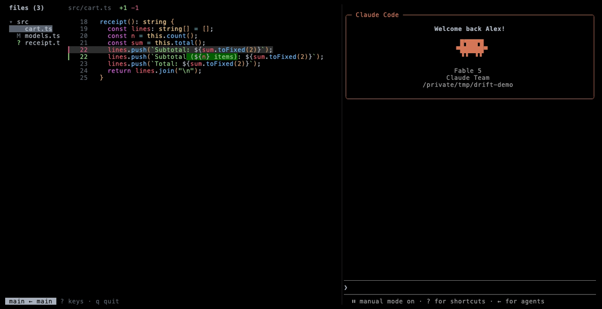

# drift

A terminal UI for reviewing your working changes like a pull request:
everything that differs from the base branch — committed or not — in one
view. **[tothalex.github.io/drift](https://tothalex.github.io/drift/)**


The comparison point is `git merge-base <base> HEAD`, diffed against the
working tree, so committed work, uncommitted edits, and untracked files
all show up together. The base branch is auto-detected (`origin/HEAD`,
then `main`, then `master`), and can be switched from inside the app.

The same UI also opens real pull requests: browse the repo's open
GitHub PRs or GitLab MRs, read the discussion, reply to review threads,
comment on lines, resolve, delete — without leaving the terminal. See
[Pull requests](#pull-requests).

## Install

**macOS / Linux**

```sh
curl -fsSL https://tothalex.github.io/drift/install.sh | sh
```

Prebuilt binaries (x86_64/aarch64) land in `~/.local/bin` (override with
`DRIFT_INSTALL_DIR`).

**Windows (experimental)**

Grab `drift-windows-x86_64.zip` from the
[latest release](https://github.com/tothalex/drift/releases/latest) and
unzip it. Then, from PowerShell in the folder containing `drift.exe`, move
it somewhere permanent and add that folder to your user `PATH`:

```powershell
New-Item -ItemType Directory -Force "$env:LOCALAPPDATA\Programs\drift" | Out-Null
Move-Item drift.exe "$env:LOCALAPPDATA\Programs\drift\"
[Environment]::SetEnvironmentVariable("Path",
  [Environment]::GetEnvironmentVariable("Path", "User") + ";$env:LOCALAPPDATA\Programs\drift", "User")
```

Open a new terminal and `drift` is available. (Alternatively: Start menu →
"Edit environment variables for your account" → edit `Path` → add the
folder there.) Windows Terminal is recommended. Windows support is new —
if something misbehaves, please
[open an issue](https://github.com/tothalex/drift/issues).

Or build from source on any platform: see [Build](#build).

## Usage

```sh
drift              # review the current repo
drift --base dev   # compare against a different base
drift ~/some/repo  # review another repository
drift --pr 123     # open pull request #123 right away
```

## The diff view

The primary view is your own working changes — everything since the
base branch, kept live as you edit:

- Changes are shown inside their enclosing code block (function, class,
  if, …) resolved with tree-sitter, not as bare hunks; the scope can be
  widened and narrowed with `[` and `]`. Other files fall back to plain
  hunks.
- Changed lines are marked by gutter accents and word-level emphasis on
  the exact edit.
- Comment-only lines render as prose with `TODO`/`FIXME` tags accented;
  unchanged comment blocks can be folded to a one-line summary.
- Two-pane focus: `h` aims the cursor keys at the file tree, `l` at the
  code view (the lit-up header shows which; clicking a pane focuses it
  too). `H`/`L` step between files, skipping ones checked off.
- Each pane keeps its own `/` search with match highlighting; `n`/`N`
  cycle the focused pane's matches — and in an unsearched code view
  they hop between the changes themselves, so large files navigate by
  edit, not by scrolling.
- File tree with review progress: check files off as you go, navigation
  skips what's done.
- Vim-style keys (counts, `g`/`G`, visual mode, yank) and full mouse
  support (wheel per pane, click, drag-to-copy, pane resize).
- Live reload: the working tree is watched, so edits made outside the
  app — your editor, an AI agent, a `git commit` — appear as they land,
  without losing your cursor or scroll position. Gitignored paths
  (build artifacts) never trigger a refresh.
- Press `e` to open the file in your editor at the cursor's line
  (neovim by default, configurable — see below); edits show up in the
  diff the moment you save.
- Review scopes: press `b` (or click the branch name in the status bar)
  to switch the base branch, then narrow the review to one commit or to
  untracked files only — or keep everything at once.
- All views are precomputed on background threads — navigation stays
  instant regardless of changeset size.

Press `?` inside the app for all keybindings.

## Syntax & themes

Highlighting ships with the One Dark Pro palette. Every color is
configurable — UI accents and the full syntax palette alike, with
per-language overrides, and a custom theme is a single TOML file next
to the config. See [Configuration](#configuration).

Languages install on demand (see [Languages](#languages)): no grammar
is compiled into drift itself. Files without an installed language
still review fine — they show as plain hunks without colors or block
scoping.

## Languages

Every language is a plugin: a tree-sitter grammar fetched and compiled
on your machine, plus a highlight query. The first time drift shows a
file whose language is available but not installed, it offers it right
there — press `y` and keep reviewing while the grammar builds in the
background; highlighting and block scoping appear in place when it's
ready. `n` declines for the session.

The same works from the command line:

```sh
drift lang install rust      # curated: c, css, go, html, java, javascript,
                             #   json, python, ruby, rust, toml, tsx, typescript
drift lang install https://github.com/tree-sitter-grammars/tree-sitter-zig
drift lang list              # installed and installable
drift lang build             # rebuild all grammars (after a drift upgrade)
drift lang remove rust
```

Installing needs `git` and a C compiler — the only place drift uses
either. A plugin lives in `~/.config/drift/languages/<name>/`:

- `language.toml` — the manifest: language name, file extensions, the
  grammar repo pinned to a commit, and `block_kinds`, the grammar's
  node kinds that count as reviewable blocks (what `[`/`]` widen to);
- `highlights.scm` — the tree-sitter highlight query, yours to edit.
  For the languages drift curates deeply (rust, typescript, tsx,
  javascript, python, go) the installed file is drift's full query
  stack: the grammar's bundled queries *plus* hand-tuned supplements
  that close the gaps against editor-grade highlighting. Other
  languages get the grammar repo's bundled query.

Compiled grammars are cached in `~/.cache/drift/grammars/`, and
`[theme.<name>]` sections theme any installed language.

Curated entries are complete, tested manifests (and query stacks)
checked into this repo's [`languages/`](languages/) directory — adding
one to the registry is a one-file PR. URL installs scaffold the
manifest and point out what only a human can fill in (chiefly
`block_kinds`; `drift lang build` flags node kinds the grammar doesn't
have). Note that grammars are native code compiled into a library
drift loads — install only grammars you trust.

## Pull requests

drift doubles as a PR review tool. Press `p` (or run `drift --pr 123`)
to list the repository's open pull requests (GitHub) or merge requests
(GitLab) and open one — the same file tree, block-scoped diffs, review
progress, and search as the primary view, with the whole review
conversation in place:


- Inline review threads sit under the exact diff lines they were written
  on, with their resolved/unresolved state; `T` folds a thread down to
  its head line. Threads that no longer match the current diff stay
  reachable instead of disappearing.
- A virtual `# conversation` entry pinned at the top of the tree holds
  the PR description, the PR-level discussion, and those outdated
  threads.
- Comment anywhere: `a` on a diff line starts a new inline thread, `a`
  on a thread's `[a] reply` row answers that thread, and `A` writes a
  PR-level comment from wherever you are.
- Comments are composed in a small in-app box — `enter` posts,
  `shift+enter` (or `alt+enter` in terminals without the kitty keyboard
  protocol) adds a line, `esc` cancels; the box's footer shows the keys
  that work in your terminal. While a comment posts, a spinner marks
  the exact row it will land on.
- On comment rows `r` toggles the thread resolved/unresolved and `d`
  (pressed twice, with the author named in the confirmation) deletes
  your comment — the `[r]`/`[d]` hints under each thread advertise
  them; elsewhere both keys keep their global meanings.
- `r` refetches the open pull request without losing your place; `p`
  (or clicking the `#N` status segment) returns to the list, where the
  first row leads back to your local changes.
- When the PR's commits exist locally (after any `git fetch`), diffs get
  full syntax highlighting and block scoping; otherwise drift falls back
  to the plain hunk view — no fetch is ever run for you.

drift talks to the forge through the official CLIs — [`gh`] for GitHub,
[`glab`] for GitLab — so install the one for your forge and run its
`auth login` once. That's also what makes GitHub Enterprise and
self-managed GitLab work: authenticate the CLI against your host
(`gh auth login --hostname git.corp.example`) and drift picks the forge
from the repo's `origin` remote. If your hostname names neither
"github" nor "gitlab", set it explicitly in the config:

```toml
[forge]
kind = "gitlab"          # or "github"
# gh = "/path/to/gh"     # binary overrides, if not on PATH
# glab = "/path/to/glab"
```

[`gh`]: https://cli.github.com
[`glab`]: https://gitlab.com/gitlab-org/cli

## Send to an AI agent

Reviewing often turns into asking: *why is this here? explain this.
refactor that.* Press `s` on a line — or on a visual-mode selection —
to hand it to an AI agent CLI running in a sibling pane. A small box
takes your instruction; `enter` delivers a ready prompt into the
agent's input: the instruction, the full `path:lines` location, and
the selected code fenced below it. A selection that covers a change is
sent unified-diff style — `-` old lines, `+` new lines — so the agent
sees exactly what changed; unchanged code goes plain.



This works through [herdr], a terminal workspace manager for AI coding
agents — or through plain tmux. In herdr, drift finds every agent pane
automatically, with its live idle/working state. In tmux, agent panes
are recognized by their running process (claude, codex, aider, …) with
the same closest-first targeting; tmux just can't say whether an agent
is idle or working. Auto-detection prefers herdr when drift runs inside
both; `backend = "tmux"` forces tmux from anywhere. An agent split in drift's own tab wins outright —
the drift-beside-claude layout never shows a picker. Otherwise one
agent pane and the prompt goes straight there; several and a picker
asks (closest first, each row saying where its agent is — "this tab",
or its workspace and tab names — and preselecting the last one used).
Inside the compose box `↑`/`↓` re-aim the prompt at another session at
any point — the title follows. The choice sticks: once a prompt has
gone to a session, later sends aim there directly until that pane goes
away. The `[agent]` config section can pin a target for good:

```toml
[agent]
# backend = "auto"    # auto | herdr | tmux | off — naming one forces
#                     # it even when drift runs outside that session
# target = "claude"   # pin an agent name or pane id; empty = auto-pick
# submit = true       # false: stage the prompt in the agent's input
#                     # without pressing enter, to edit it there first
# template = "{input}\n\n{file}:{lines}\n```\n{code}\n```"
#                     # {file} is the absolute path; {relfile} the
#                     # repo-relative one, {start}/{end} bare numbers
```

drift never talks to a model itself — the prompt lands in the agent you
already have open, with its context, session, and subscription. Other
multiplexers (WezTerm, kitty) can plug into the same seam later.

[herdr]: https://herdr.dev

## Configuration

Every keybinding and color is configurable via
`~/.config/drift/config.toml` (respects `$XDG_CONFIG_HOME`). Generate the
documented default file with:

```sh
drift --init-config
```

Keys take single characters, named keys (`enter`, `space`, `tab`, arrows,
`pageup`/`pagedown`, `home`/`end`), optionally prefixed `ctrl-`; listing
an action replaces all of its default keys. Colors take ANSI names,
256-color indexes, or hex values — including the full syntax palette,
and a `[theme.<lang>]` section (naming any installed or curated
language — rust, typescript, go, …) overrides any syntax color for
that language only. A top-level `base = "…"` sets the default
comparison branch.

Colors layer in three steps: a base colorscheme, then `[theme]` /
`[theme.<lang>]` overrides on top. The built-in colorscheme is
`onedark`; a custom one is a file next to the config:

```toml
# ~/.config/drift/config.toml
colorscheme = "mytheme"

# ~/.config/drift/themes/mytheme.toml — same keys as [theme]; missing
# keys keep the built-in defaults
keyword = "#fb4934"
string = "#b8bb26"

[rust]
bracket = "#fe8019"
```

The editor is a top-level `editor = "…"` command; `{file}` and `{line}`
are substituted, and the file path is appended when `{file}` is absent:

```toml
editor = "nvim +{line}"           # the default
# editor = "code -g {file}:{line}"
# editor = "subl {file}:{line}"
```

## Build

```sh
cargo build --release   # binary at target/release/drift
cargo test
```

Git repositories are read natively (via gitoxide) — the `git` binary is
not required to review. Only `drift lang install`/`build` shell out to
`git` and a C compiler, to fetch and compile grammar plugins.
